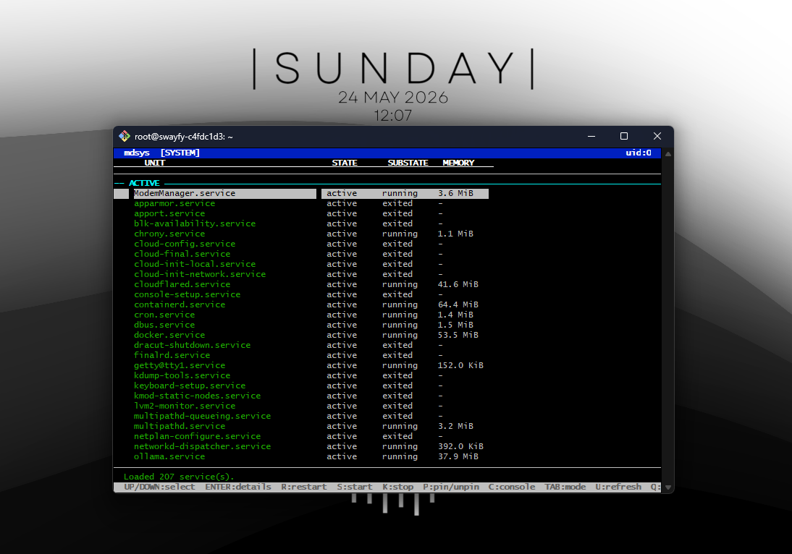

# mdsys

A terminal UI (TUI) manager for `systemd` services on Linux/WSL.  
Displays user or system services with status, RAM usage, and lets you control them from the keyboard.



## Install

### Debian / Ubuntu (apt)

```bash
echo "deb [trusted=yes] https://hdmain.github.io/mdsys ./" \
  | sudo tee /etc/apt/sources.list.d/mdsys.list
sudo apt update
sudo apt install mdsys
```

### Fedora / AlmaLinux / CentOS (dnf)

```bash
sudo tee /etc/yum.repos.d/mdsys.repo <<'EOF'
[mdsys]
name=mdsys
baseurl=https://hdmain.github.io/mdsys/rpm
enabled=1
gpgcheck=0
EOF
sudo dnf install mdsys
```

On CentOS 7 / older systems with `yum` only:

```bash
sudo yum install mdsys
```

### Arch Linux (pacman)

```bash
sudo tee -a /etc/pacman.conf <<'EOF'

[mdsys]
SigLevel = Optional TrustAll
Server = https://hdmain.github.io/mdsys/arch/
EOF
sudo pacman -Sy mdsys
```

Then run:

```bash
mdsys
```

## Register a program as a service

**Binary (simple):**

```bash
mdsys ./prot httpprot
```

**Binary with flags:**

```bash
mdsys -b ./myapp --port 8080 -n api-service
```

**Command** (npm, python, etc.):

```bash
mdsys -c npm start -n discordbot
```

Then start and enable:

```bash
systemctl start  discordbot
systemctl enable discordbot   # auto-start on boot
```

This creates `/etc/systemd/system/httpprot.service` (or `~/.config/systemd/user/` when not root), reloads systemd, and pins the service to the top of the TUI automatically.

## Keybindings

| Key | Action |
|-----|--------|
| `↑` / `↓` or `W` / `J` | Navigate |
| `Enter` | Open service details |
| `R` | Restart selected service |
| `S` | Start selected service |
| `K` | Stop selected service |
| `P` | Pin / unpin (persisted to `~/.config/mdsys/pinned`) |
| `C` | Open console log (`journalctl … \| less`) |
| `Tab` | Toggle system ↔ user mode |
| `U` | Refresh list |
| `Q` | Quit |

## Features

- Lists system or user services (`systemctl` / `systemctl --user`)
- Shows active state, sub-state, and live RAM (`MemoryCurrent`)
- **Pinned** category — pin important services to the top; pins are saved across sessions
- **Details** view — description, PID, memory, start timestamp
- **Console** — opens `journalctl` output for the selected service in `less`
- Register any binary as a systemd service with one command
- Animated loading screen
- Color-coded TUI (green = active, dimmed = inactive, yellow = pinned)
- Auto-detects real user when run as root

## WSL notes

Make sure systemd is enabled in WSL before using mdsys.

1. Edit `/etc/wsl.conf`:
   ```ini
   [boot]
   systemd=true
   ```
2. Restart WSL from PowerShell:
   ```powershell
   wsl --shutdown
   ```
3. Open WSL again and verify:
   ```bash
   systemctl status
   # should show: State: running
   ```
4. Try mdsys:
   ```bash
   mdsys          # opens TUI — press Tab to switch system/user mode
   ```

## Build from source

**Dependencies (Ubuntu/Debian):**

```bash
sudo apt install build-essential cmake libncurses-dev
```

**Build:**

```bash
cmake -S . -B build -DCMAKE_BUILD_TYPE=Release
cmake --build build -j
./build/mdsys
```

**Build packages:**

```bash
cmake -S . -B build -DCMAKE_BUILD_TYPE=Release
cmake --build build -j
cd build && cpack -G DEB    # Debian/Ubuntu
cd build && cpack -G RPM    # Fedora/Alma/CentOS
cp packaging/arch/PKGBUILD . && makepkg -sf   # Arch Linux
```

## License

MIT
